# Netflix FAQ Assistant

This repository holds the code for an assignment from Study.com's
[Artificial Intelligence Course](https://study.com/academy/course/computer-science-311-artificial-intelligence.html).

## Introduction

The Netflix FAQ Assistant is a chatbot application designed to answer questions
about the Netflix streaming service. The application utilizes the
[OpenRouter](https://openrouter.ai/) API to provide the main Large Language
Model (LLM), which is then optimized via
[Retrieval-Augmented Generation (RAG)](https://en.wikipedia.org/wiki/Retrieval-augmented_generation)
to field questions commonly posed on
[Netflix's Help Center](https://help.netflix.com/en).

### Local Dev Setup

This application was developed on Linux, but a basic understanding of git, the
command line, and a standard python development workflow is all that is required
to get this application running.

You'll also need to sign up for an OpenRouter account and setup an API key, and
optionally a Hugging Face account and API key as well. This section will
demonstrate setting up the application for local development and use.

**Clone the repository**

First, clone this repository, and navigate into the project directory:

```sh
git clone https://github.com/tomit4/netflix_faq_assistant && cd netflix_faq_assistant
```

**Setup the virtual environment**

Once in the project directory, you'll need to establish a python virtual
environment to ensure that when you install the application's dependencies, they
do not conflict with your OS level python packages.

First create the virtual environment:

```sh
python -m venv .venv
```

And then activate the virtual environment:

```sh
source .venv/bin/activate
```

You might see your shell prompt change visually in some way to indicate you have
activated the virtual environment.

**Upgrading pip**

Once you have activated the virtual environment, it is good practice to update
`pip`:

```sh
python -m pip install --upgrade pip
```

**Installing dependencies**

Once you have updated `pip`, you can install the application's needed
dependencies by using `pip` with the provided `requirements.txt` file:

```sh
python -m pip install -r requirements.txt
```

Note that depending on your internet connection, the installing of dependencies
might take a while. This application pulls in
[sentence-transformers](https://pypi.org/project/sentence-transformers/), which
can take a while to install.

**Environment Variables**

This application utilizes the OpenRouter API and the Hugging Face API for it's
chat and embedding models respectively. Within the project's main directory,
you'll find a `env.sample` file. In preparation for setting up the API keys,
copy this file as a `.env` file:

```sh
cp env.sample .env
```

### Setting up API keys

As mentioned earlier, this application uses the
[OpenRouter](https://openrouter.ai/) API to pull in a GPT LLM model. In order to
utilize OpenRouter's API, you must create an account with them and then create
an API key. The steps are rather straightforward.

**OpenRouter API**

First navigate, to [OpenRouter's homepage](https://openrouter.ai).

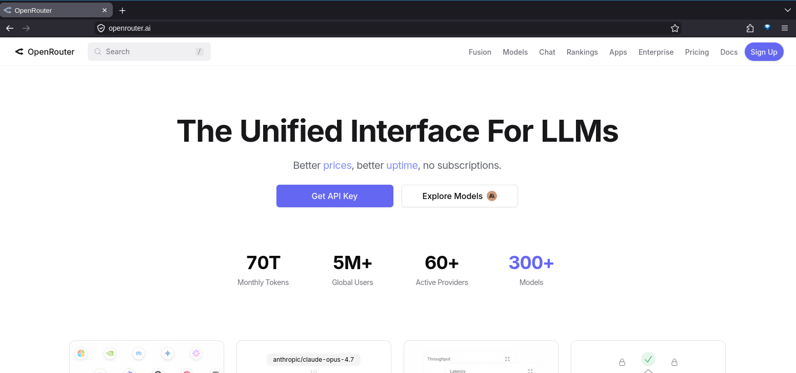

Then, click on the Sign Up button.

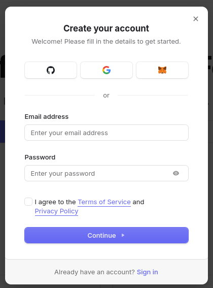

You'll be prompted to create an account. Choose whichever method you prefer and
follow the sign up instructions. It is rather straight forward. Once you have
signed up and verified your account, you'll be brought back to their homepage,
click on the "Get API Key" link, and you'll be redirected to a menu:

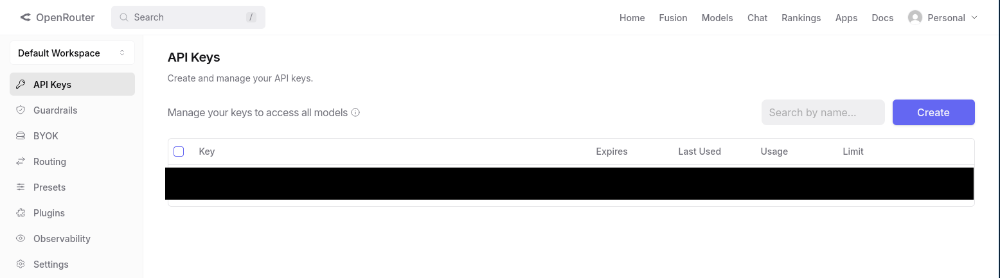

Click on the "Create" button, and a modal menu will be brought up:

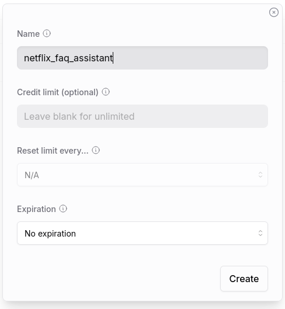

You can enter any name for the API key you like. Once you have entered a name
for the API key, click on the "Create" button in the modal menu.

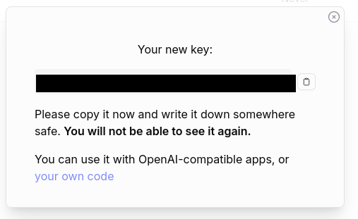

You'll then be presented with a long string of letters/digits, this is your API
key. Copy this string and then paste it into the `.env` file you created
earlier, specifically in the OPENROUTER_API_KEY field.

```.env
OPENROUTER_API_KEY="<your_openrouter_api_key_goes_here>"
HF_TOKEN=""
```

Once you have done this, go ahead and close the modal menu on the OpenRouter
interface. You should see the name of your API key here.

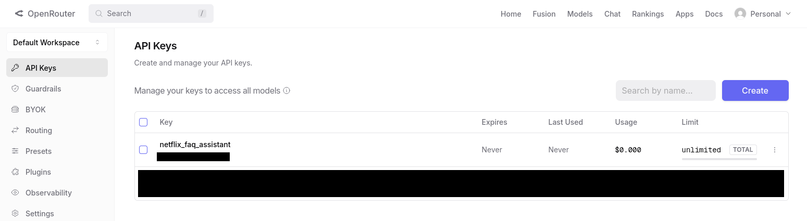

It is worth noting that while using the application, that on the free tier of
OpenRouter, you are allowed up to 50 requests per 24 hour period.

**Hugging Face API**

This application also utilizes the Hugging Face API to interface with an
embedding model. This step is optional as you can interface with this model
without establishing an API key, but the application may run into rate limits
without it. This section outlines signing up with Hugging Face, establishing an
API key, and inputting that into the `.env` file, much like the process for
setting up the OpenRouter API key.

First navigate to the [Hugging Face web page](https://huggingface.co/):

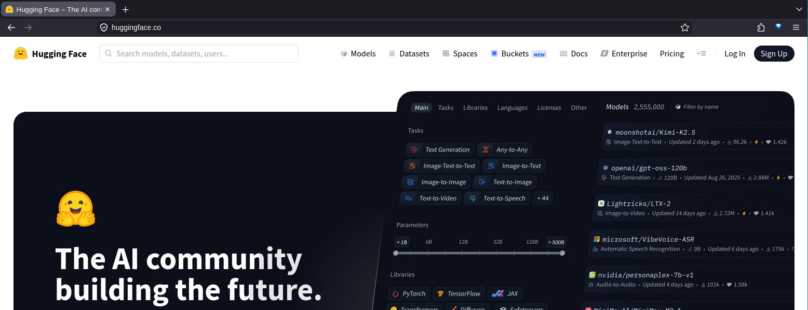

And click on the "Sign Up" button.

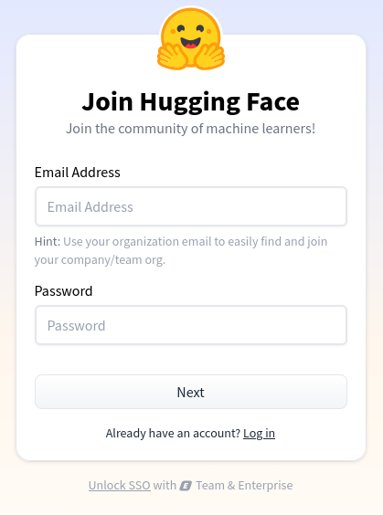

You'll be presented with a sign up form. Enter your email and password and
follow their sign up instructions.

Once you have set up an account with Hugging Face, you'll be presented with
their application interface:

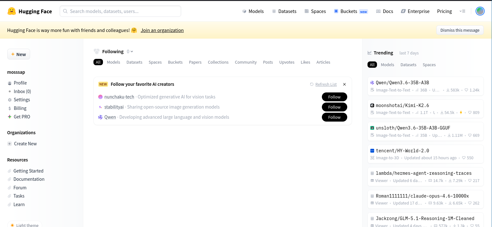

Click on your account avatar picture in the top right corner of the screen, by
default, it is a circle with a series of colors in it:

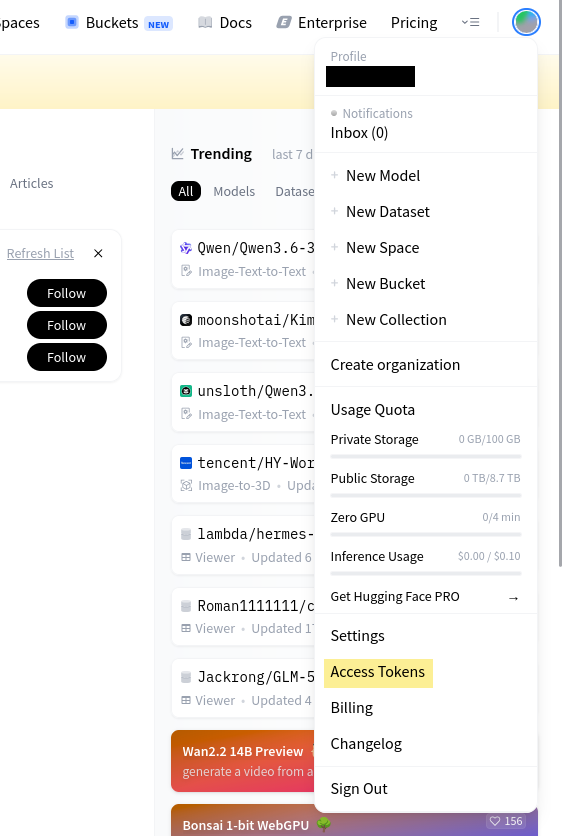

A drop down menu will be presented to you, go ahead and click on the "Access
Tokens" menu option. This will redirect you to another page where you can create
an API key.

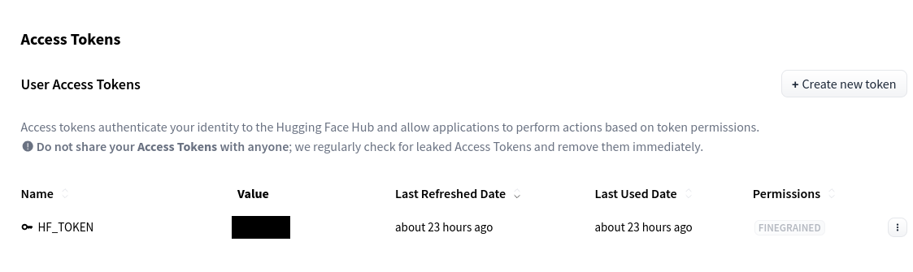

Click on the "Create new token" button, and you will be provided with a series
of options to setup for the API key.

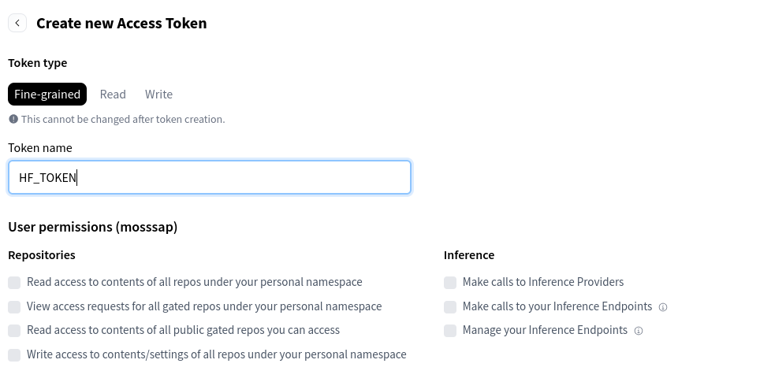

Fill out the name of the token. Note that you _must_ name the token HF_TOKEN.
You don't have to fill out any of the other fields as this is just to have more
forgiving rate limits from Hugging Face. Scroll to the bottom of the menu and
click on the "Create token" button:

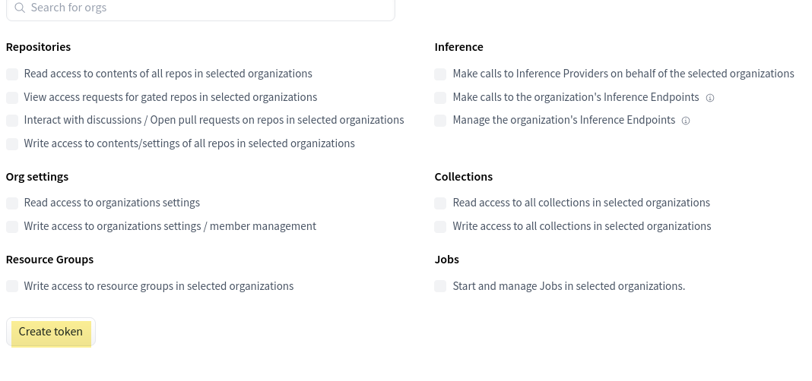

You'll be presented with a modal that has a long string of letters/digits. Copy
this string and paste it into the HF_TOKEN field of the `.env` file:

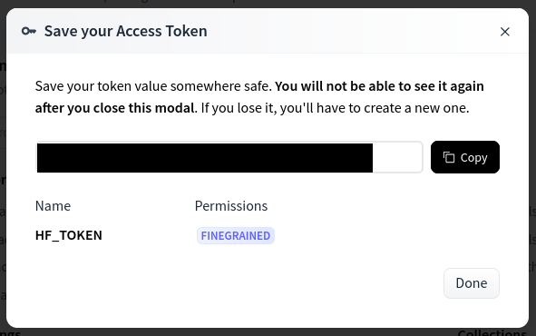

```.env
OPENROUTER_API_KEY="<your_openrouter_api_key_goes_here>"
HF_TOKEN="<your_hugging_face_api_key_goes_here>"
```

Once you have copied the Hugging Face API key into the `.env` file, go ahead and
click on the "Done" button in the Hugging Face web interface. Once you've done
so, you'll see your created API key in their menu:

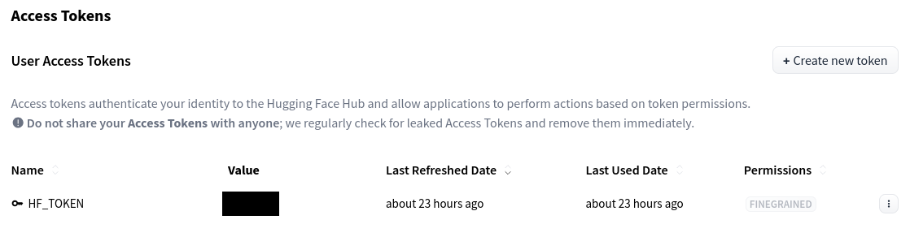

### Running the application

To run the application, simply open it using python:

```sh
python main.py
```

You should be presented with a simple CLI interface through which you can
interact with the chatbot. Note that this chatbot has been optimized via RAG,
and therefore can only answer queries related to the data on which it was
augmented (_i.e._ queries related to the Netflix streaming service). Typing
`help` will bring up a short help message, and typing `quit` or `exit` will exit
the program.

### Disclaimer

This application is developed as part of an academic assignment for educational
purposes only. It is not affiliated with, endorsed by, or connected to Netflix,
OpenRouter, or Hugging Face.

The chatbot’s responses are generated using a Large Language Model (LLM) and a
retrieval-based context system. While efforts have been made to ground responses
in a curated dataset, outputs may still contain inaccuracies, omissions, or
model-generated hallucinations.

All API usage is subject to the respective providers’ terms of service,
including rate limits and usage restrictions. Performance and availability may
vary depending on external service constraints.

Users should not rely on this application for official or authoritative
information regarding Netflix services.
